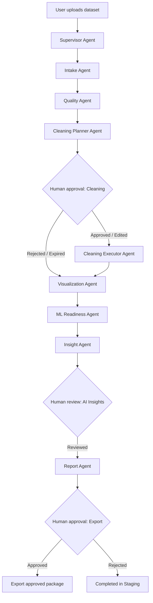

# IntelliData Governed Agent Platform

A production-oriented, agent-orchestrated data intelligence platform with governed tool execution, explicit Human-in-the-Loop (HITL) approval, and immutable data versioning.

Built on Streamlit, Python 3.12, Pandas, and Plotly, with optional Google Gemini integration.

---

## 1. Agent Architecture Diagram



See [docs/AGENT_ARCHITECTURE.md](docs/AGENT_ARCHITECTURE.md) for full architectural specifications and [docs/DEMO_WALKTHROUGH.md](docs/DEMO_WALKTHROUGH.md) for the live presentation script.

---

## 2. Specialized Agents

1. **Supervisor Agent (`SupervisorAgent`)**:
   - Orchestrates multi-agent transitions: `intake -> quality -> cleaning_plan -> waiting_for_cleaning_approval -> cleaning_execution -> visualization_and_eda -> ml_readiness -> insight_generation -> waiting_for_insight_review -> report_generation -> waiting_for_export_approval -> completed`.
   - Halts at approval checkpoints; resumes only after user decisions.
   - Enforces max step limits to prevent infinite loops.

2. **Data Intake Agent (`IntakeAgent`)**:
   - Inspects schema, checks for duplicate column names, detects 100% empty columns, identifies suspicious identifier columns, and detects date-like strings.
   - Strictly inspection-only; never alters data.

3. **Data Quality Agent (`QualityAgent`)**:
   - Computes completeness, duplicate rate, type consistency, and IQR outliers.
   - Produces heuristic quality scores (0-100) and actionable warnings without mutating rows.

4. **Cleaning Planner Agent (`CleaningPlannerAgent`)**:
   - Analyzes quality findings and formulates governed `Proposal` items with assigned risk levels (`low`, `medium`, `high`).
   - Protects identifier and target columns; never fills all-null columns; never auto-executes transformations.

5. **Cleaning Executor Agent (`CleaningExecutorAgent`)**:
   - Executes **only** explicitly approved proposals using registered deterministic tools.
   - Never executes rejected, expired, or pending proposals.
   - Commits each transformation to a new dataset version (`v1`, `v2`, ...) while preserving `original_dataset` immutable.
   - Supports one-click rollback to the parent version.

6. **Visualization Agent (`VisualizationAgent`)**:
   - Inspects distributions and correlations to recommend semantically sound charts.
   - Enforces aggregation safety: non-additive measures (ratings, satisfaction scores, percentages, IDs) are never summed.

7. **ML Readiness Agent (`MLReadinessAgent`)**:
   - Evaluates machine learning feasibility (target leakage, class imbalance, feature scaling, encoding needs).
   - Suggests baseline algorithms without unauthorized automatic model training.

8. **Insight Agent (`InsightAgent`)**:
   - Generates structured hypotheses with explicit confidence levels.
   - Strictly prevents claiming causation from correlation.
   - Prompts contain bounded statistical summaries; zero raw dataset rows are transmitted.

9. **Report Agent (`ReportAgent`)**:
   - Compiles approved findings, active dataset summaries, and the complete audit trail into an HTML governance report.
   - Requires explicit human export authorization before generating downloadable packages.

---

## 3. Governed Tool Registry

All agent capabilities are strictly mediated by `tools.registry.registry`:
- Unknown tool names are rejected with `UnregisteredToolError`.
- Agents cannot import or execute arbitrary LLM-generated code.
- Destructive tools check for valid approval before executing.

| Registered Tool | Purpose | Requires Approval? | Destructive? |
| :--- | :--- | :---: | :---: |
| `validate_dataset` | Extension & file size validation | No | No |
| `load_dataset` | Safe file parsing into DataFrame | No | No |
| `profile_dataset` | Column profiling & cardinality checks | No | No |
| `assess_quality` | Multi-dimensional quality scoring | No | No |
| `run_eda` | Statistical moments & correlations | No | No |
| `preview_cleaning` | Sandboxed cleaning preview | No | No |
| `execute_cleaning` | Deterministic transformation execution | **Yes** | **Yes** |
| `rollback_cleaning` | Restore dataset to parent version | **Yes** | **Yes** |
| `recommend_visualizations` | Semantic chart recommendations | No | No |
| `assess_ml_readiness` | Machine learning feasibility diagnosis | No | No |
| `generate_ai_summary` | Bounded statistical executive summary | No | No |
| `generate_business_insights` | Structured hypotheses from correlations | No | No |
| `generate_report` | Compile HTML intelligence report | No | No |
| `export_dataset` | Package approved active dataset & audit | **Yes** | No |

---

## 4. Human-in-the-Loop (HITL) Model & Approval Flow

### Approval Statuses
- **`pending`**: Proposal formulated by planner agent; execution blocked.
- **`approved`**: Approved by human reviewer; queued for executor execution.
- **`rejected`**: Disallowed by human reviewer; original data preserved, proposal marked rejected.
- **`edited`**: Approved with human-edited parameters (e.g. customized fill strategy or threshold).
- **`expired`**: Superseded or timed-out; cannot be executed.

### Approval Capabilities in UI
- Individual **Approve** and **Reject** buttons per proposal with optional rejection notes.
- **Edit Parameters & Approve**: Interactive JSON parameter editor.
- **High-Risk Confirmation Guard**: High-risk actions (outlier capping, dropping columns) require explicit acknowledgment before approval can be triggered.
- **Batch Selection**: Multi-select proposals to approve collectively without a blind single-click approve-all.
- **"Why am I seeing this?"**: Contextual explanation beside every proposal.

---

## 5. Audit Logging & Data Versioning

### Audit Log
Every workflow event creates an immutable `AuditEvent`:
- Recorded events: `Dataset imported`, `Intake completed`, `Quality analysis completed`, `Proposal created`, `Approval requested`, `Proposal approved`, `Proposal rejected`, `Proposal edited`, `Cleaning executed`, `Cleaning rolled back`, `AI insight generated`, `AI output reviewed`, `Report generated`, `Export approved`, `Export completed`, `Agent failure`.
- Filterable in real time in the UI and downloadable as CSV.

### Data Versioning & Immutability
- `WorkflowState.original_dataset`: Preserved immutable in memory. Never mutated.
- `WorkflowState.active_dataset`: Current working dataset.
- `WorkflowState.versions`: Full version graph (`v0`, `v1`, `v2`, ...) with change summaries and parent links.
- **Rollback**: Users can roll back to any parent version to undo transformations.

---

## 6. AI Privacy Boundaries & Fallback Behavior

### Privacy Boundaries
- **Zero Raw Data Rows**: Prompts include only column metadata and summary statistics (quantiles, missing %, correlation values).
- **Untrusted Input Sanitization**: Column names and values are sanitized to prevent prompt injection.
- **Human Verification Required**: All AI hypotheses are explicitly labelled as hypotheses and require human review before export.

### Graceful Fallback
- Gemini is completely optional. If `GEMINI_API_KEY` is absent or the API is unavailable:
  - Local agents continue running without interruption.
  - Deterministic heuristic fallbacks generate executive summaries and structured hypotheses from Pearson correlations.
  - The UI clearly states that AI is operating in local deterministic fallback mode.
  - Zero secrets or internal stack traces are ever exposed to the UI.

---

## 7. How to Run Locally

```powershell
# 1. Create and activate virtual environment (Python 3.12 recommended)
python -m venv venv
.\venv\Scripts\Activate.ps1

# 2. Install dependencies
pip install -r requirements.txt

# 3. (Optional) Configure Gemini API key in .env
Copy-Item .env.example .env
# Edit .env and supply GEMINI_API_KEY="your-key-here"

# 4. Launch the application
streamlit run app.py
```

Open `http://localhost:8501`. Navigate to **Agent Governance Hub** in the sidebar.

---

## 8. How to Test the Workflow

Run the test suite and linters:

```powershell
# Run all unit and integration tests (including the 20 governance tests)
python -m pytest -q

# Run ruff code linter
python -m ruff check app.py agents workflow tools ui modules utils tests

# Verify dependency integrity
python -m pip check
```

---

## 9. Example End-to-End User Journey

1. **Dataset Intake**: The user uploads a spreadsheet (or clicks *Explore sample workspace*).
2. **Supervisor Launch**: In the **Agent Governance Hub**, the user clicks **⚡ Run Autonomous Pipeline**.
3. **Autonomous Inspection**: `IntakeAgent` validates schema; `QualityAgent` scores data quality.
4. **Planning & Pause**: `CleaningPlannerAgent` detects duplicates and missing numeric cells, creates proposals, and halts at `waiting_for_cleaning_approval`. A prominent **Review Required** banner appears.
5. **Human Approval**: The user inspects the proposal diffs, edits the imputation strategy for `score` to `custom_value = 95.0`, confirms high-risk outlier capping, and approves the proposals.
6. **Resuming Execution**: The user clicks **▶ Resume After Review**. `CleaningExecutorAgent` applies approved transformations, creates dataset version `v1`, and records audit logs.
7. **Downstream Intelligence**: `VisualizationAgent` recommends distribution charts; `MLReadinessAgent` diagnoses modeling feasibility; `InsightAgent` generates structured business hypotheses.
8. **AI Review & Export Authorization**: The user reviews the hypotheses and authorizes report export. `ReportAgent` packages the approved active dataset (`v1`), the HTML governance report, and the full audit trail for download.
