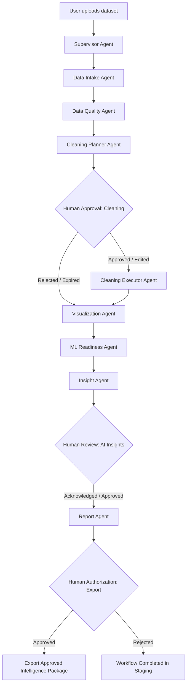

# IntelliData Governed Agent Architecture

IntelliData has evolved from a standalone analytics app into a **governed, multi-agent data intelligence platform** with explicit **Human-in-the-Loop (HITL)** checkpoints, deterministic tool execution, and an immutable data lineage model.

---

## 1. System Architecture & Lifecycle

---

## 2. Core Agent Roles & Governance Contracts

| Agent | Responsibility | Consequential Action Allowed? | Tools Used |
| :--- | :--- | :--- | :--- |
| **Supervisor Agent** (`SupervisorAgent`) | Orchestrates the multi-agent lifecycle, enforces legal transitions, halts at checkpoints, and handles loop prevention (`max_steps`). | No | Internal dispatch |
| **Data Intake Agent** (`IntakeAgent`) | Validates schema, detects duplicate column names, empty columns, suspicious identifier columns, and nested values. | No (Inspection only) | `profile_dataset` |
| **Data Quality Agent** (`QualityAgent`) | Profiles missing values, duplicate rows, mixed types, constant columns, high-cardinality features, and IQR outliers. Calculates quality score. | No (Inspection only) | `profile_dataset`, `assess_quality` |
| **Cleaning Planner Agent** (`CleaningPlannerAgent`) | Analyzes quality findings and formulates granular `Proposal` objects with assigned risk levels (`low`, `medium`, `high`). Protected columns are respected. | No (Proposals only) | None (Pure planning) |
| **Cleaning Executor Agent** (`CleaningExecutorAgent`) | Executes **only** approved proposals via deterministic, registered tools. Creates a new immutable dataset version. Supports rollback. | **Yes, only with explicit HITL approval** | `execute_cleaning`, `rollback_cleaning` |
| **Visualization Agent** (`VisualizationAgent`) | Evaluates profile and EDA statistics to recommend semantically sound charts. Non-additive measures (ratings, percentages, scores) are never summed. | No | `run_eda`, `recommend_visualizations` |
| **ML Readiness Agent** (`MLReadinessAgent`) | Evaluates data suitability for machine learning (leakage, imbalance, scaling, encoding). Explains limitations without training unauthorized models. | No | `assess_ml_readiness` |
| **Insight Agent** (`InsightAgent`) | Generates structured business hypotheses with confidence ratings and explicit correlation-vs-causation disclaimers. Prompts contain zero raw data rows. | No | `generate_ai_summary`, `generate_business_insights` |
| **Report Agent** (`ReportAgent`) | Compiles approved findings, active dataset statistics, and audit trail into an HTML governance report. Proposes package export. | **Yes, only with explicit HITL export authorization** | `generate_report`, `export_dataset` |

---

## 3. Human-in-the-Loop (HITL) Checkpoints

Every consequential mutation or export must halt at a governed approval checkpoint:

1. **Cleaning Approval Checkpoint (`waiting_for_cleaning_approval`)**:
   - Triggered when `CleaningPlannerAgent` detects quality issues and formulates cleaning proposals.
   - Proposals include before/after summaries, affected row/column counts, and risk levels.
   - High-risk operations (e.g. outlier capping or dropping columns) require explicit risk acknowledgment.
   - User can:
     - **Approve**: Mark single proposal approved.
     - **Reject**: Mark proposal rejected with an optional reviewer note.
     - **Edit & Approve**: Modify execution parameters (e.g. change fill strategy or custom value) before approving.
     - **Batch Apply**: Select multiple proposals and apply simultaneously (no blind single-click approve-all).

2. **AI Insights Review Checkpoint (`waiting_for_insight_review`)**:
   - The user reviews hypotheses generated from summary statistics.
   - Unverified claims are prevented from entering official reports without human verification.

3. **Export Authorization Checkpoint (`waiting_for_export_approval`)**:
   - Required before dataset bundles and audit logs are packaged and exported.

---

## 4. Governed Tool Registry

All agent actions are routed through `tools.registry.registry`:
- Unknown tool names are rejected with `UnregisteredToolError`.
- No agent is permitted to execute arbitrary Python code or LLM-generated strings.
- Destructive tools (`execute_cleaning`, `rollback_cleaning`) verify valid `ApprovalRequest` state before execution.

Registered tools:
- `validate_dataset`
- `load_dataset`
- `profile_dataset`
- `assess_quality`
- `run_eda`
- `preview_cleaning`
- `execute_cleaning`
- `rollback_cleaning`
- `recommend_visualizations`
- `assess_ml_readiness`
- `generate_ai_summary`
- `generate_business_insights`
- `generate_report`
- `export_dataset`

---

## 5. Dataset Immutability & Version Lineage

- **Original Dataset**: Preserved in `WorkflowState.original_dataset` as an immutable deep copy taken at upload.
- **Active Dataset**: `WorkflowState.active_dataset` represents the currently approved working copy.
- **Dataset Versions**: Tracked in `WorkflowState.versions`:
  - `v0`: Initial upload.
  - `v1, v2, ...`: Created whenever approved transformations execute.
  - Each version records `version_id`, `parent_version_id`, `created_by`, `created_at`, `change_summary`, and `dataframe`.
- **Rollback**: Users can invoke rollback to restore `active_dataset` to its parent version at any time.

---

## 6. Audit Trail

Every state change emits an `AuditEvent` with:
- `timestamp`: UTC ISO timestamp
- `actor_type`: `agent`, `human`, or `system`
- `actor_name`: Name of the specific agent or human reviewer
- `event_type`: Standardized event categorization
- `proposal_id` & `approval_id`: Traceable references
- `metadata`: Contextual parameters and diffs

The audit trail is rendered in real time in the UI and packaged with all dataset exports.
