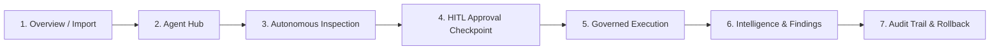

# IntelliData Platform Demo & Presentation Guide

A step-by-step presentation script, live demonstration walkthrough, and talking points for showcasing the **Governed Multi-Agent Data Intelligence Platform**.

---

## 🎯 30-Second Elevator Pitch

> *"Most AI data tools today act like a black box: an LLM makes silent decisions, mutates raw data under the hood, or generates unverifiable claims. We transformed this application into a **governed, multi-agent data intelligence platform**. Multiple specialized agents inspect, score, and plan actions, but **consequential actions are strictly blocked behind explicit Human-in-the-Loop (HITL) checkpoints**. Every transformation produces a versioned candidate, every decision is auditable, and the original dataset remains strictly immutable."*

---

## 🚀 How to Launch the Demo Locally

In PowerShell:
```powershell
d:\Desktop\autoclean\auto_eda_cleaner\venv\Scripts\streamlit run app.py
```
Open **`http://localhost:8501`** in your browser.

---

## 🗺️ Live Demonstration Walkthrough



---

### Step 1: The Setup & Dataset Loading
* **Where to go:** In the left sidebar, click **Overview** or **Import data**.
* **What to do:**
  1. Click **"Explore sample workspace"** (or upload `Titanic-Dataset.csv` from the project root via **Import data**).
  2. Notice the sidebar updates with:
     - Active Workspace filename (`Titanic-Dataset.csv` or `Commerce demo · synthetic`)
     - Current Version: `● Original version` (`v0`)
     - Workflow notice banner linking directly to the Agent Hub.
* **What to say:**
  > *"When data is ingested, IntelliData takes an immutable deep copy of the raw dataset. Regardless of what cleaning or transformations happen later, the original data can never be altered or lost."*

---

### Step 2: Entering the Agent Governance Hub
* **Where to go:** In the sidebar under **Workspace**, click **Agent Governance Hub**.
* **What to show on screen:**
  - The **Agent Activity Timeline**: Displays `Intake Agent`, `Quality Agent`, `Cleaning Planner Agent`, `Checkpoints`, `Executor`, `Visualization`, `ML Readiness`, `Insight Agent`, and `Report Agent`.
  - The **Status Header**: Showing stage `intake`, status `○ Idle`, active version `v0`, and step counter `0 / 50`.
* **What to do:**
  - Click the **⚡ Run Autonomous Pipeline** button.
* **What to say:**
  > *"When we trigger the pipeline, the Supervisor Agent coordinates the specialized agents. The Data Intake Agent validates schema and detects suspicious identifiers; the Data Quality Agent calculates completeness, duplicate rates, and IQR outliers."*

---

### Step 3: The First Human-in-the-Loop (HITL) Checkpoint
* **What happens:**
  - The pipeline **halts immediately** at `waiting_for_cleaning_approval`.
  - A prominent yellow alert appears: **`⚠️ Review Required: The autonomous workflow is currently paused...`**
  - The timeline highlights `⏳ Awaiting Decision` on the Cleaning Approval Checkpoint.
* **What to show on screen:**
  - Scroll down to the **🛡️ Governance & Approvals** tab.
  - Show the individual proposal cards generated by `CleaningPlannerAgent`:
    1. **Remove Exact Duplicate Rows** (Risk: `LOW`)
    2. **Trim Surrounding Whitespace** (Risk: `LOW`)
    3. **Impute Missing Numeric Values** (Risk: `MEDIUM` or `HIGH` depending on missing %)
    4. **Cap Extreme Outliers** (Risk: `HIGH`)
* **What to say:**
  > *"Notice that the planner agent did not touch the dataset. Our non-negotiable safety rule is that agents can propose, but they never silently execute. Each proposal contains the affected columns, row counts, projected before/after diffs, and an assigned risk level."*

---

### Step 4: Demonstrating Human Control (Approve, Reject, Edit)
* **What to show on screen:**
  1. **"Why am I seeing this?" expander:** Click it on any proposal to show that the system provides context explaining why the agent suggested the fix.
  2. **High-Risk Confirmation Guard:**
     - Point to the **Cap Extreme Outliers** card.
     - Notice that the **Approve** button is disabled until you check the explicit acknowledgment:
       *`⚠️ I understand that this proposal carries HIGH risk...`*
     - Explain: *"This prevents accidental one-click destructive operations on continuous distributions."*
  3. **Edit Parameters & Approve:**
     - Open **"✏️ Edit Parameters & Approve"** on the numeric missing value proposal.
     - Show the JSON editor: change `"strategy": "median"` to `"custom_value": 95.0`.
     - Click **Save & Approve**.
  4. **Granular Rejection:**
     - On one proposal (e.g., text trimming or deduplication), enter a rejection note: *"Keep duplicates for raw transaction verification"* and click **✕ Reject**.
  5. **Batch Approval:**
     - Select checkboxes for remaining proposals and click **Apply Selected Approvals**.
* **What to say:**
  > *"We deliberately avoid a single blind 'Approve All' button. Humans have granular control: approve single actions, reject with reasons, edit execution parameters in place, or batch-apply explicitly selected proposals."*

---

### Step 5: Governed Execution, Immutability & Rollback
* **What to do:**
  1. Click **▶ Resume After Review** at the top.
  2. The `CleaningExecutorAgent` executes **only** the approved and edited proposals.
  3. Notice the header: Active Version has upgraded from **`v0`** to **`v1`**!
* **What to show on screen:**
  - Switch to the **📜 Full Audit Trail & Rollback** tab.
  - Point to the banner: **`Rollback Available: Active dataset is version v1`**.
  - Click **↩ Rollback to Parent**.
  - Show how the dataset version rolls back cleanly, and a `Cleaning rolled back` event is recorded in the audit trail.
* **What to say:**
  > *"Every execution creates a new immutable version in the version tree. If a transformation produces unexpected downstream effects, one click rolls back to the parent version without needing to reload the data."*

---

### Step 6: Downstream Intelligence (Visualization, ML, AI Hypotheses)
* **What to do:**
  - Click **⚡ Run Autonomous Pipeline** or **Resume** to complete downstream stages.
  - Switch to the **🔍 Intelligence & Findings** tab.
* **What to show on screen:**
  1. **Visualization Agent:**
     - Point out the chart recommendations.
     - Highlight the semantic aggregation rule: *"Notice that for measures like satisfaction rating, score, or churn percentage, the agent refuses to use 'sum'—it recommends distribution, box plot, or mean, preventing semantically invalid charts."*
  2. **ML Readiness Agent:**
     - Shows the readiness score (e.g., 78/100), detected target leakage, encoding needs, and class imbalance.
     - Emphasize: *"It diagnoses model readiness, but it never trains an unauthorized model automatically."*
  3. **Insight Agent:**
     - Shows structured hypotheses with explicit confidence levels (`High`, `Medium`, `Low`) and correlation-vs-causation disclaimers.
     - Emphasize: *"No raw data rows were sent to Gemini. Only bounded summary statistics and Pearson correlation pairs were shared. Furthermore, if Gemini is offline, a deterministic heuristic fallback runs automatically."*

---

### Step 7: The Export Authorization & Complete Audit Trail
* **What to show on screen:**
  - Show the final checkpoint: `waiting_for_export_approval`.
  - Go to the **📜 Full Audit Trail & Rollback** tab:
    - Show the chronological table tracking every `actor_name` (e.g., `DataIntakeAgent`, `CleaningPlannerAgent`, `human_user`), `event_type`, timestamp, and proposal ID.
    - Filter by actor or event type.
    - Click **📥 Download Audit Trail (CSV)** to show that compliance documentation is generated automatically.

---

## 🛠️ CLI Proof of Technical Rigor

Run these commands in a side terminal to prove robustness to technical audiences:

```powershell
# 1. Run all 44 unit and integration tests
.\venv\Scripts\python -m pytest -q

# 2. Verify zero linter warnings or code-style violations
.\venv\Scripts\python -m ruff check app.py agents workflow tools ui modules utils tests

# 3. Verify zero broken dependencies
.\venv\Scripts\python -m pip check
```

---

## 💎 Key Talking Points Cheat Sheet

| Core Pillar | What to Highlight |
| :--- | :--- |
| **Safety First** | *"We do not let LLMs write raw arbitrary code that executes on user data. All transformations run via deterministic, registered Python tools."* |
| **Human-in-the-Loop** | *"Every impactful transformation requires human consent. High-risk proposals require explicit acknowledgment checkboxes."* |
| **Privacy by Design** | *"Zero raw dataset rows leave the machine. Prompts are strictly bounded to statistical moments and schemas with prompt-injection sanitization."* |
| **Full Auditability** | *"Every single proposal, review decision, edit, execution, and rollback is recorded in an immutable audit trail."* |
| **Reversibility** | *"Dataset versions form a parent-child tree. Any cleaning action can be rolled back with one click."* |
